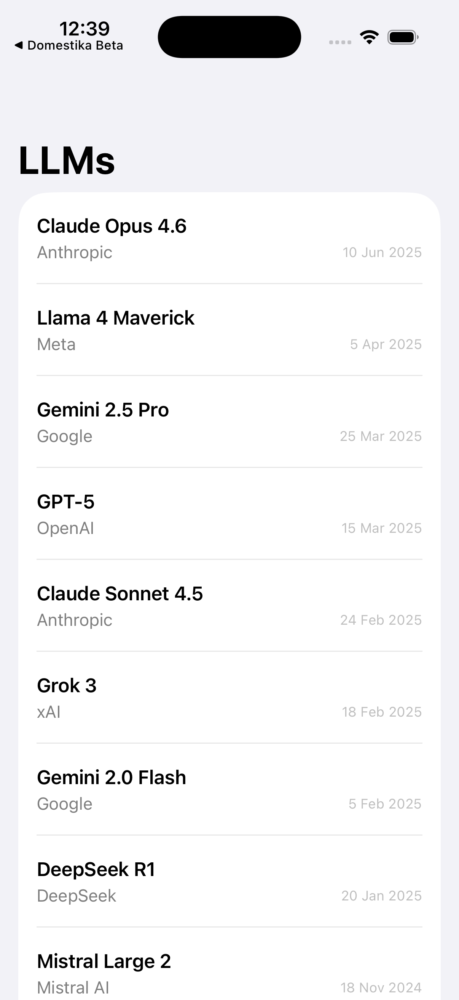
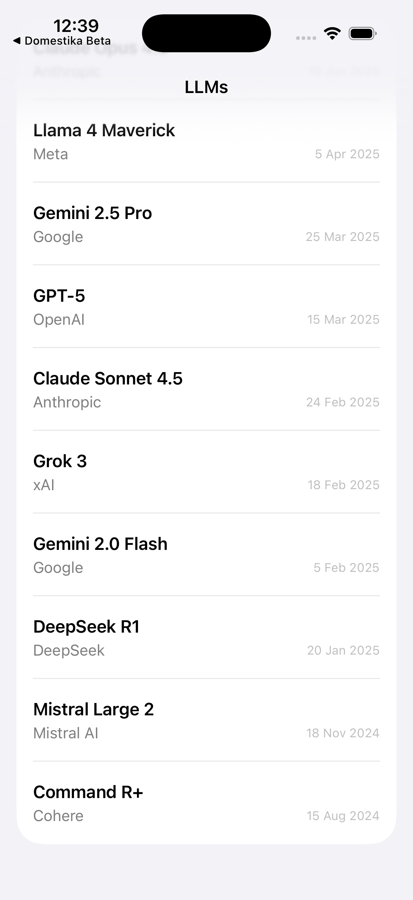

# KataLLMiOS

iPhone app that displays a curated list of Large Language Models (LLMs) with details about each one. Built with SwiftUI following MVVM-C architecture, managed using [Claude Code](https://claude.ai/code) and GitHub.

## Screenshots

| List | Detail |
|------|--------|
|  |  |

## Architecture

The project follows **MVVM-C** (Model-View-ViewModel-Coordinator) with a clean layered structure:

| Layer | Responsibility |
|-------|---------------|
| **Domain** | `LLM` model |
| **Data** | Repository pattern, local JSON data source, DTO mapping |
| **Presentation** | Views, ViewModel with state enum, Coordinator with `NavigationStack` |
| **Core** | Dependency injection container, error types |

## Libraries

| Library | Purpose |
|---------|---------|
| **SwiftUI** | Declarative UI framework |
| **Swift Concurrency** | async/await for all asynchronous work |

No third-party dependencies are used at this time.

## Requirements

- Xcode 26.2+
- iOS 26.2+
- Swift 5.0

## Build & Run

Clone the repository:

```bash
git clone git@github.com:voghDev/KataLLMiOS.git
cd KataLLMiOS
```

Build for iOS Simulator:

```bash
xcodebuild -project KataLLMiOS.xcodeproj \
    -scheme KataLLMiOS \
    -configuration Debug \
    -destination 'platform=iOS Simulator,name=iPhone 17 Pro,OS=26.2' \
    build
```

Or open `KataLLMiOS.xcodeproj` in Xcode and run on a simulator.

## License

MIT License - see [LICENSE](LICENSE) for details.

## Author

Olmo Gallegos
